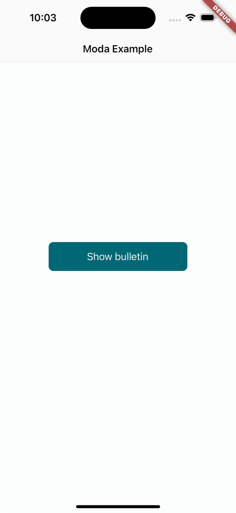

# moda

`moda` is a comprehensive Dart library designed to simplify the implementation of modal sheets and bulletins in your Flutter applications. This library offers a collection of pre-built and customizable modal sheets and bulletins that you can easily integrate into your Flutter projects.

## Features

- Bulletins: The library also offers customizable bulletins that allow you to display important information, alerts, or announcements in a visually appealing way. Bulletins can be displayed prominently at the top of the screen and can include icons, titles, descriptions, and action buttons.

